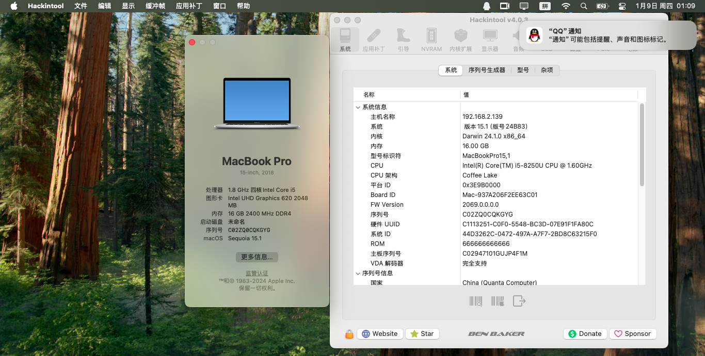

# HP-ProBook-430-G5-黑苹果

应用于HP ProBook 430 G5的OpenCore 1.0.3的黑苹果引导 支持macOS Sequoia

注意：此EFI不含三码 实际使用时请自行使用[OCAT](https://github.com/ic005k/OCAuxiliaryTools)生成

##### 配置清单:
- 英特尔 Core i5-8250U CPU (KabyLake R)
- 英特尔 UHD 620 核芯显卡
- 8GB*2 DDR4 2400MHz RAM(已升级)
- 13.3寸 内建 IPS 显示屏
- 内建I2C 触控板
- 英特尔 AC 3165 Wi-Fi5 网卡(非原装)
- USB 3.0接口2个 Type-C(USB 3.1)接口1个
- HDMI输出接口
- SD卡读卡器
- 杂牌256GB NGFF 固态硬盘(非原装)
- 西部数据 WD10SPCX 机械硬盘(自添加)
- BIOS 版本 Q85 Ver.01.30.00

##### BIOS 设置:
- 禁用 Intel SGX
- 启用 系统管理命令(System Management Command)
- 禁用 快速启动(Fast Boot)
- 启用 USB存储启动(USB Storage Boot)
- 禁用 网络PXE引导(Network PXE Boot)
- 禁用 来电自启动(Power On when AC Detected)
- 禁用 开盖自启动(Power On when Lid is Opened)
- 调整 UEFI引导顺序(UEFI Boot Order)
- 禁用 传统引导顺序(Legacy Boot Order)
- 禁用 传统引导支持(Legacy Boot)
- 禁用 安全引导(Secure Boot)
- 禁用 MS UEFI CA密钥(MS UEFI CA key)
- 禁用 英特尔傲腾(Intal Optane)
- 启用 CPU睿频加速(Turbo Boost)
- 启用 超线程技术(Hyperthreading)
- 启用 CPU多核模式(Multi Processor)
- 启用 VT-x 虚拟化技术(Virtualization Technology)
- 禁用 VT-d 基于I/O设备的虚拟化技术(Virtualization Technology for Directed I/O)
- 启用 来电睿频(Turbo Boost on DC)
- 启用 DPTF 动态平台和热框架(Dynamic Platform and Thermal Framework)
- 启用 HP应用程序与驱动程序(HP Application Driver)
- 启用 有线网络控制器(LAN Controller)
- 禁用 网络唤醒(Wake on LAN)
- 调整 核显显存(Video memory)为512MB
- 启用 音频设备(Audio Device)
- 启用 麦克风(Microphone)
- 启用 内置扬声器(Internal Speakers)
- 启用 耳机输出(Headphone Output)
- 禁用 键盘Wi-Fi开关(Lock Wireless Button)
- 启用 无线Wi-Fi网络(Wireless Network Device (WLAN))
- 启用 蓝牙(Bluetooth)
- 禁用 有线/无线局域网切换(LAN/WAN Auto Switching)
- 禁用 Wi-Fi唤醒(Wake on WLAN)
- 禁用 电池供电下的局域网唤醒(Wake on LAN in Battery Mode)
- 启用 升压转换器(Boost Converter)
- 启用 内置摄像头(Integrated Camera)
- 启用 SD读卡器(Media Card Reader)
- 启用 左USB口(Left USB Ports)
- 启用 右USB口(Right USB Ports)
- 启用 右USB口1(Right USB Port 1)
- 启用 右USB口2(Right USB Port 2)
- 允许 所有USB设备(all USB Devices)
- 禁用 从Type-C接口更新固件(USB-C Controller Firmware Update)
- 启用 实时电源管理(Runtime Power Management)
- 启用 扩展空闲电源状态(Extended Idle Power States)
- 启用 深度睡眠(Deep Sleep)
- 禁用 开盖唤醒(Wake when Lid is Opened)
- 禁用 来电唤醒(Wake when AC is Detected)
- 禁用 USB唤醒(Wake on USB)
- 启用 电源控制器(Power Control)

##### 可以工作的部分:
- macOS Sonoma - macOS Sequoia
- 英特尔核显
- 1366 x 768最大分辨率
- USB 3.0接口和Type-C接口
- 有线网口
- 内建的扬声器，麦耳机与麦克风。
- 睡眠与唤醒不完美，离电情况下盒盖可能会睡死。
- Wi-Fi连接(需要使用[OCLP-Mod](https://github.com/laobamac/OCLP-Mod)打补丁)
- 蓝牙功能
- 电池读数
- CPU电源管理
- 使用键盘进行亮度调整
- 使用键盘进行音量调整
- 触控板可多点触控
- 内置摄像头
- SD卡读卡器

##### 未测试的部分
- 蓝牙音响耳机
- Apple ID登录与登出 以及相关应用(FaceTime, iMessage, App Store)

##### 不可工作的部分:
- HDMI 音视频输出
- 指纹读取器
- 空投与接力(需要更换为博通网卡且使用[OCLP-Mod](https://github.com/laobamac/OCLP-Mod)打补丁)

